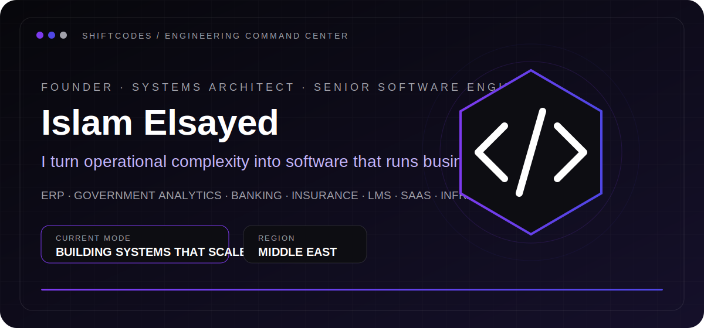
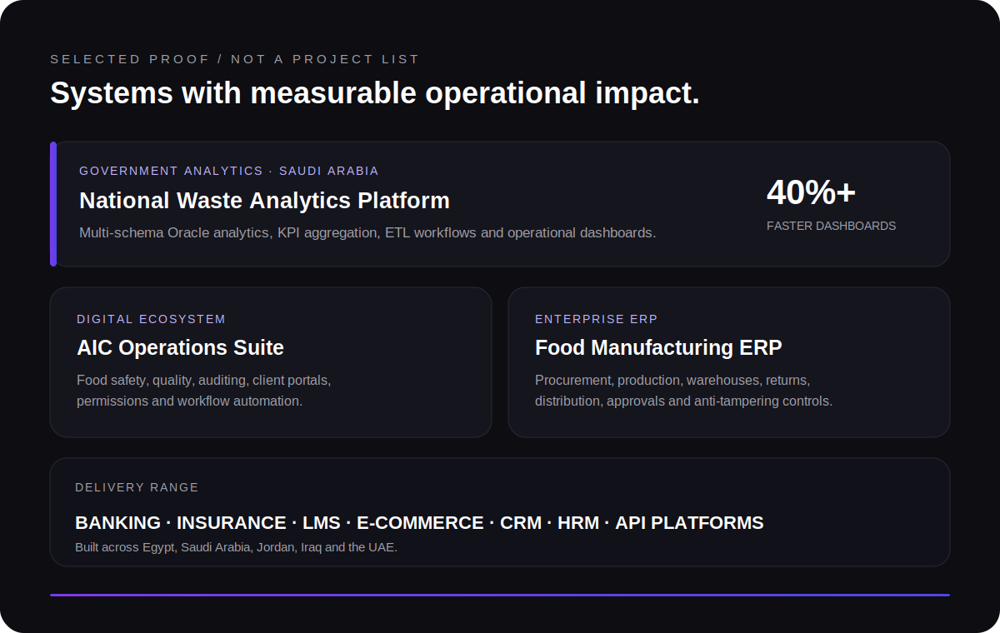

 

 

 

 

### Production software for operations that cannot afford to stop.

`Laravel` · `Filament` · `Django` · `FastAPI` · `React` · `Next.js` · `Oracle` · `PostgreSQL` · `Redis` · `Docker` · `Linux`

 

**Most commercial systems are private because they power real client operations.**

 

