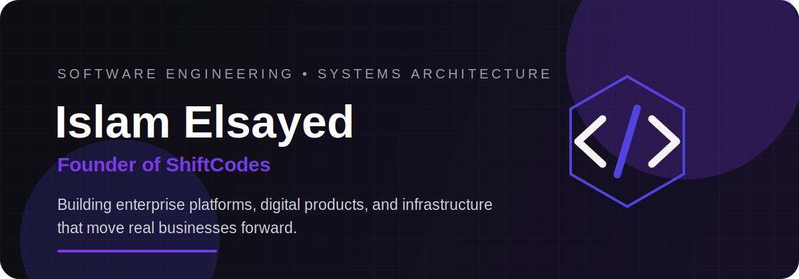

<div align="center">



<br />

[](https://shiftcodes.net)
[](mailto:eslamjackie@outlook.com)
[](https://github.com/TPCT)

</div>

<br />

<table>
<tr>
<td width="58%" valign="top">

## I engineer systems, not just features.

Senior Software Engineer and founder of **ShiftCodes**, focused on turning complex operations into secure, scalable, production-grade software.

I work across the full lifecycle: business discovery, system architecture, backend engineering, product delivery, infrastructure, optimization, and long-term evolution.

> Most current commercial systems are private because they power real client operations across the Middle East.

</td>
<td width="42%" valign="top">

### Current Focus

```text
Enterprise ERP        ██████████
Business Automation   ██████████
Backend Architecture  ██████████
Data & Analytics      █████████░
Digital Products      █████████░
Infrastructure        ████████░░
```

</td>
</tr>
</table>

## The systems behind the code

<table>
<tr>
<td width="25%" align="center">
<h3>ERP</h3>
<p>Procurement, production, warehouses, approvals, distribution and finance.</p>
</td>
<td width="25%" align="center">
<h3>Platforms</h3>
<p>SaaS, LMS, e-commerce, portals and multi-role digital products.</p>
</td>
<td width="25%" align="center">
<h3>Data</h3>
<p>ETL pipelines, operational KPIs, dashboards and enterprise reporting.</p>
</td>
<td width="25%" align="center">
<h3>Infrastructure</h3>
<p>Linux, deployment, performance, observability and production recovery.</p>
</td>
</tr>
</table>

## Selected impact

<table>
<tr>
<td width="50%" valign="top">

### National Waste Analytics · Saudi Arabia

**Django · DRF · React · Oracle 19c**

Government analytics platform working across multiple Oracle schemas and operational datasets.

- Built monthly KPI aggregation and ETL workflows
- Delivered coverage, violation, complaint and satisfaction analytics
- Improved dashboard loading performance by **40%+**

</td>
<td width="50%" valign="top">

### AIC Digital Ecosystem

**Laravel · Filament · Modular Architecture**

Connected food-safety, quality, auditing and internal operations into one digital ecosystem.

- Client, auditor and internal administration portals
- Permission-driven workflows and audit trails
- Operational reporting and compliance automation

</td>
</tr>
<tr>
<td width="50%" valign="top">

### Food Manufacturing ERP

**Laravel · Filament · MySQL · Redis**

End-to-end ERP for food and sweets manufacturing operations.

- Procurement to production and distribution
- Multi-warehouse inventory and branch transfers
- Forecasting, approvals, returns and anti-tampering controls

</td>
<td width="50%" valign="top">

### Banking & Insurance Platforms

**PHP · Yii2 · Laravel · APIs**

Digital platforms delivered for financial and insurance organizations across Jordan and Iraq.

- Customer, policy, claim and payment workflows
- Banking integrations and secure administration
- Financial calculators, APIs and operational reporting

</td>
</tr>
</table>

## Technology arsenal

<div align="center">

### Backend & Architecture


### Frontend & Product


### Data & Infrastructure


</div>

## Engineering principles

<table>
<tr>
<td width="33%" valign="top">

### Business first

The architecture must reflect how the operation truly works—not how a generic template expects it to work.

</td>
<td width="33%" valign="top">

### Built for production

Security, permissions, observability, performance and recovery are part of the product—not afterthoughts.

</td>
<td width="33%" valign="top">

### Maintainable by design

Clear modules, explicit workflows and predictable data models keep systems evolvable after launch.

</td>
</tr>
</table>

## GitHub activity

<div align="center">


</div>

<br />

<div align="center">

### Complex operation. Clear architecture. Reliable software.

Built by **Islam Elsayed** · Powered by **ShiftCodes**


</div>
