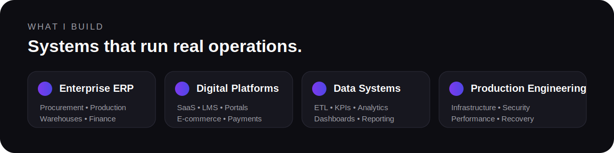
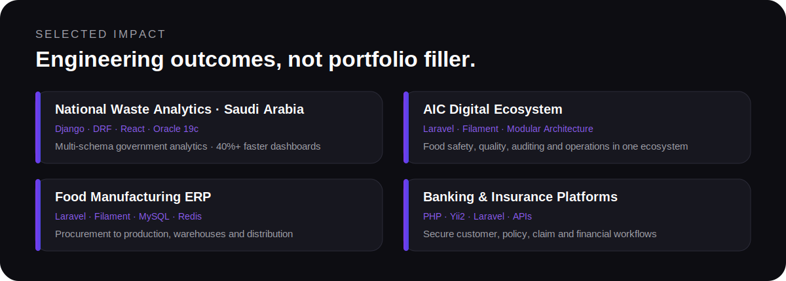

 

 

## I turn complex operations into working software.

Senior Software Engineer and founder of **ShiftCodes**, building secure, scalable systems for businesses, governments, banks, insurers, manufacturers, and digital products across the Middle East.

**Business discovery → system architecture → engineering → deployment → optimization.**

> Most current commercial systems are private because they run real client operations.

 

 

 

## Technology stack

 

## How I engineer

<table>
<tr>
<td width="33%" valign="top">
<h3>01 · Business first</h3>
Architecture should reflect the real operation, not force the business into a generic template.
</td>
<td width="33%" valign="top">
<h3>02 · Production ready</h3>
Security, permissions, observability, performance, and recovery are part of the product.
</td>
<td width="33%" valign="top">
<h3>03 · Built to evolve</h3>
Clear modules, explicit workflows, and predictable data models keep systems maintainable.
</td>
</tr>
</table>

 

### Complex operation. Clear architecture. Reliable software.

**Islam Elsayed · Founder of ShiftCodes**

