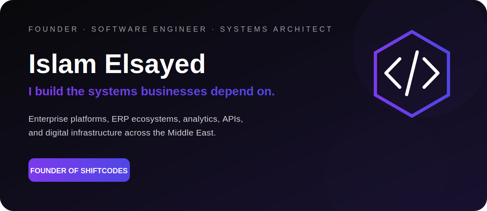
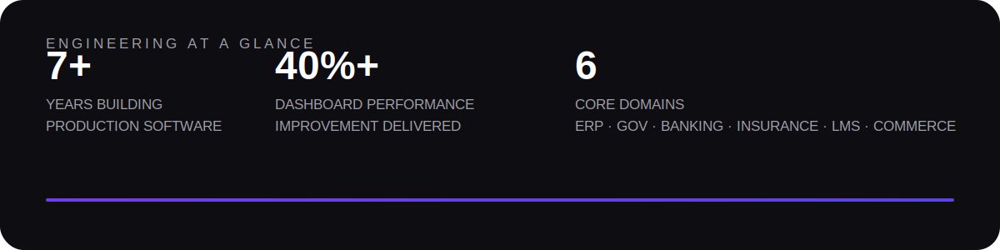
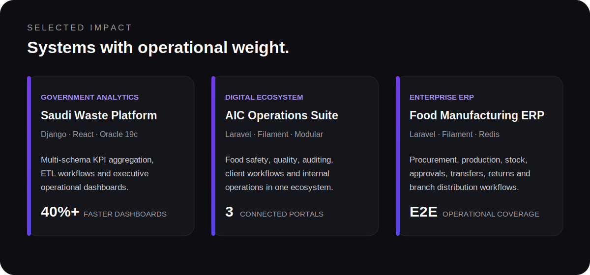

 

 

 

## I solve operational complexity with software.

I lead **ShiftCodes** and engineer production systems across the complete lifecycle: discovery, architecture, implementation, deployment, optimization, and long-term evolution.

My work spans government analytics, enterprise ERP, banking, insurance, education platforms, commerce, automation, and infrastructure across the Middle East.

> The strongest systems in this portfolio are private because they run real client operations.

 

 

## Engineering range

**Backend & Architecture**  
`Laravel` · `Filament` · `Django` · `FastAPI` · `Node.js` · `.NET` · `REST APIs` · `Modular Monoliths`

**Product & Frontend**  
`React` · `Next.js` · `TypeScript` · `Livewire` · `Blade` · `Tailwind CSS`

**Data & Infrastructure**  
`Oracle` · `MySQL` · `PostgreSQL` · `Redis` · `Docker` · `Linux` · `Apache` · `Nginx`

 

## The way I build

**01 — Understand the operation**  
The system must reflect the real business workflow, not force the business into a generic template.

**02 — Engineer for production**  
Security, permissions, observability, performance, and recovery are part of the product from day one.

**03 — Keep it evolvable**  
Clear modules, explicit workflows, and predictable data models keep software maintainable after launch.

 

### Complex operation. Clear architecture. Reliable software.

**Islam Elsayed · Founder of ShiftCodes**

