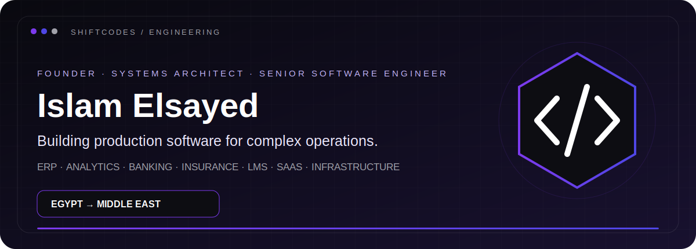
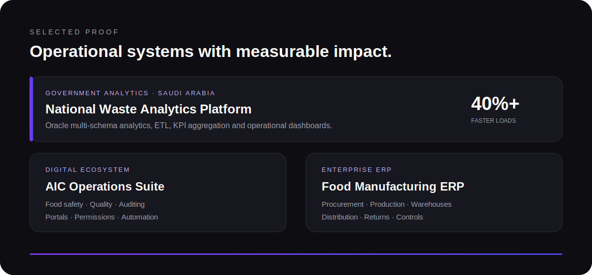
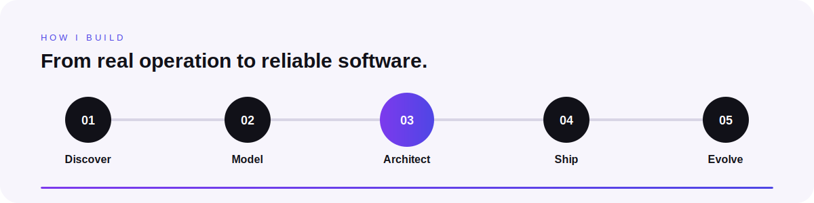

 

 

 

 

## Core Engineering Stack

<table>
<tr>
<td width="50%" valign="top" align="center">

### Languages

### Backend & Frameworks

### Frontend

</td>
<td width="50%" valign="top" align="center">

### Databases

### Infrastructure

### Architecture & Delivery

</td>
</tr>
</table>

 

### Production software for operations that cannot afford to stop.

Most commercial systems are private because they power real client operations.

 

